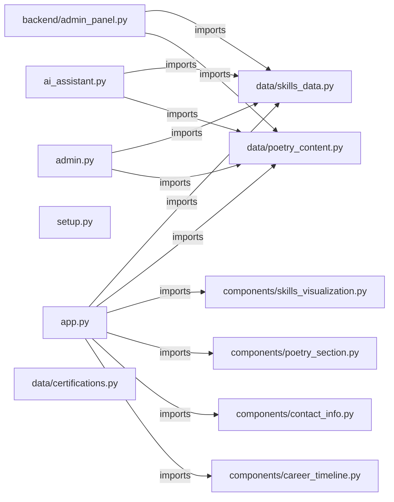

# myProfile — project architecture

[README](README.md) · [Interview questions and answers](INTERVIEW_QA.md)

## Purpose and scope

A Streamlit portfolio combining DevOps experience, poetry, interactive visualizations, AI assistance, and content administration.

This document describes files and symbols in this checkout. Deployment templates and statements in the original overview are distinguished from a verified running environment.

## Component diagram



For Python repositories, arrows show resolved local imports, not network calls or deployment order. Otherwise the diagram is a repository component map; containment arrows do not assert runtime integration.

## Components and responsibilities

| Component | Responsibility |
| --- | --- |
| [`components/skills_visualization.py`](components/skills_visualization.py) | Functions: `render_skills_visualization` |
| [`components/poetry_section.py`](components/poetry_section.py) | Functions: `render_poetry_section` |
| [`components/contact_info.py`](components/contact_info.py) | Functions: `render_contact_info` |
| [`app.py`](app.py) | Functions: `main`, `render_overview`, `render_technical_journey`, `render_skills_certifications`, `render_creative_passion`, `render_ai_assistant`, `search_skills` |
| [`components/career_timeline.py`](components/career_timeline.py) | Functions: `render_career_timeline` |
| [`backend/admin_panel.py`](backend/admin_panel.py) | Functions: `save_data_to_file`, `admin_main`, `manage_work_experience`, `manage_skills_certifications`, `manage_poetry_content`, `manage_settings` |
| [`admin.py`](admin.py) | Functions: `save_work_experience`, `save_skills_data`, `save_poetry_content` |
| [`ai_assistant.py`](ai_assistant.py) | Functions: `get_portfolio_context`, `search_skills`, `search_experience`, `search_certifications`, `generate_answer` |
| [`deploy.sh`](deploy.sh) | Implementation or supporting configuration |
| [`setup.py`](setup.py) | Functions: `run_command`, `check_python`, `install_dependencies`, `create_config`, `test_installation`, `main` |
| [`Dockerfile`](Dockerfile) | Container build/service configuration |
| [`docker-compose.yml`](docker-compose.yml) | Container build/service configuration |
| [`pyproject.toml`](pyproject.toml) | Implementation or supporting configuration |
| [`README.md`](README.md) | Project explanations or operating notes |
| [`replit.md`](replit.md) | Project explanations or operating notes |

## Implementation walkthrough

### `render_skills_visualization(skills_data)`

Source: [`components/skills_visualization.py`](components/skills_visualization.py#L6).

Render interactive skills visualization

Calls visible in this function: `all_skills.append`, `all_skills_flat.append`, `category_skills.keys`, `category_skills.values`, `dict`, `enumerate`, `fig_bar.update_layout`, `fig_radar.add_trace`, `fig_radar.update_layout`, `fig_sunburst.update_layout`, `go.Bar`, `go.Figure`.

```python
def render_skills_visualization(skills_data):
    """Render interactive skills visualization"""
    
    # Skills overview
    tab1, tab2, tab3 = st.tabs(["📊 Skills Overview", "🎯 Proficiency Levels", "📈 Skills Comparison"])
    
    with tab1:
        # Create a comprehensive skills dataframe
        all_skills = []
        for category, skills in skills_data.items():
            for skill, proficiency in skills.items():
                all_skills.append({
                    'Category': category,
                    'Skill': skill,
                    'Proficiency': proficiency
                })
        
        skills_df = pd.DataFrame(all_skills)
        
        # Sunburst chart for skills hierarchy
        fig_sunburst = px.sunburst(
            skills_df,
```

The excerpt is truncated; the linked source contains the full implementation.

### `render_poetry_section(poetry_content)`

Source: [`components/poetry_section.py`](components/poetry_section.py#L4).

Render the poetry and creative passion section

Calls visible in this function: `datetime.datetime.now`, `enumerate`, `len`, `random.choice`, `st.button`, `st.columns`, `st.expander`, `st.info`, `st.markdown`, `st.success`, `st.tabs`, `st.write`.

```python
def render_poetry_section(poetry_content):
    """Render the poetry and creative passion section"""
    
    # Header
    st.markdown("""
    <div style="text-align: center; padding: 2rem; background: linear-gradient(135deg, #667eea 0%, #764ba2 100%); 
                color: white; border-radius: 10px; margin-bottom: 2rem;">
        <h2>🎭 Where Technology Meets Poetry</h2>
        <p style="font-style: italic; font-size: 1.1rem;">
            "In the silence between keystrokes, poetry is born"
        </p>
    </div>
    """, unsafe_allow_html=True)
    
    # Introduction
    st.markdown("### 📖 My Creative Journey")
    st.write(poetry_content["introduction"])
    
    # Tabs for different poetry content
    tab1, tab2, tab3, tab4 = st.tabs(["💫 Favorite Quotes", "🎵 Listening Preferences", "🔗 Tech & Poetry", "✨ Reflection"])
    
    with tab1:
```

The excerpt is truncated; the linked source contains the full implementation.

### `render_contact_info()`

Source: [`components/contact_info.py`](components/contact_info.py#L3).

Render contact information and social links

Calls visible in this function: `contact_info.items`, `st.button`, `st.columns`, `st.info`, `st.markdown`, `st.success`.

```python
def render_contact_info():
    """Render contact information and social links"""
    
    # Header
    st.markdown("""
    <div style="text-align: center; padding: 2rem; background: linear-gradient(135deg, #667eea 0%, #764ba2 100%); 
                color: white; border-radius: 10px; margin-bottom: 2rem;">
        <h2>📞 Let's Connect & Collaborate</h2>
        <p style="font-size: 1.1rem;">
            Whether you want to discuss DevOps, cloud architecture, or share a beautiful poem!
        </p>
    </div>
    """, unsafe_allow_html=True)
    
    # Contact Information
    col1, col2 = st.columns([1, 1])
    
    with col1:
        st.markdown("### 📧 Contact Information")
        
        contact_info = {
            "📧 Email": "akhileshranjan.ks@gmail.com",
```

The excerpt is truncated; the linked source contains the full implementation.

### `render_ai_assistant()`

Source: [`app.py`](app.py#L168).

Calls visible in this function: `', '.join`, `SKILLS_DATA.values`, `generate_ai_answer`, `len`, `search_experience`, `search_skills`, `st.columns`, `st.divider`, `st.expander`, `st.info`, `st.markdown`, `st.metric`.

```python
def render_ai_assistant():
    st.markdown('<h2 class="section-header">AI Portfolio Assistant</h2>', unsafe_allow_html=True)
    
    st.markdown("""
    <div style="text-align: center; padding: 2rem; background: linear-gradient(135deg, #667eea 0%, #764ba2 100%); 
                color: white; border-radius: 10px; margin-bottom: 2rem;">
        <h3>🤖 Ask me anything about Akhilesh's profile!</h3>
        <p>Get instant answers about experience, skills, certifications, and more</p>
    </div>
    """, unsafe_allow_html=True)
    
    # Search functionality
    search_mode = st.selectbox(
        "Choose search type:",
        ["Smart Q&A", "Skills Search", "Experience Search", "Quick Facts"]
    )
    
    if search_mode == "Smart Q&A":
        st.subheader("💬 Ask Questions")
        
        # Suggested questions
        suggestions = [
```

The excerpt is truncated; the linked source contains the full implementation.

## Data and state

- [`ai_assistant.py`](ai_assistant.py) defines module-level containers: `insights`.
- [`data/certifications.py`](data/certifications.py) defines module-level containers: `CERTIFICATIONS`, `CERTIFICATION_CATEGORIES`, `CERTIFICATION_STATS`.
- [`data/poetry_content.py`](data/poetry_content.py) defines module-level containers: `POETRY_CONTENT`.
- [`data/skills_data.py`](data/skills_data.py) defines module-level containers: `SKILLS_DATA`, `CERTIFICATIONS`, `CORE_COMPETENCIES`.
- [`data/work_experience.py`](data/work_experience.py) defines module-level containers: `WORK_EXPERIENCE`.

Module-level dictionaries/lists live in a Python process. They can be fixtures or mutable state; inspect writes before treating them as persistent storage. A production extension would need to define persistence and concurrency behavior explicitly.

## Data flow and design decisions

### What is the input-to-output contract of `render_skills_visualization`

In [`components/skills_visualization.py`](components/skills_visualization.py#L6), `render_skills_visualization(skills_data)` receives the inputs. The function computes these intermediate values:

- `tab1, tab2, tab3 = st.tabs(['📊 Skills Overview', '🎯 Proficiency Levels', '📈 Skills Comparison'])`

### Which decision rules or boundary conditions should an interviewer challenge

The implementation in [`components/skills_visualization.py`](components/skills_visualization.py#L6) branches on:

- `selected_category == 'Cloud Platforms'`
- `selected_category == 'DevOps & CI/CD'`
- `i < 5`
- `selected_category == 'Containerization'`
- `selected_category == 'Programming Languages'`
- `selected_category == 'MLOps Tools'`

A useful extension is a table-driven test that covers each condition just below, at, and above its boundary where applicable. These expressions are the current rules; changing them changes behavior and should be justified by the project’s acceptance criteria.

## Setup and verification

Follow the existing README and the component-specific instructions linked above. No new application start command is asserted for this repository.

No dedicated test files were found in the inspected first-party file inventory. A future implementation should add executable acceptance checks.

## Operating boundaries and design review

Before turning this checkout into a customer deployment, establish the input contract, data ownership, access controls, failure response, evaluation criteria, and rollback owner. Repository fixtures and unit tests demonstrate local behavior; they do not establish throughput, uptime, compliance, or business impact.

A useful architecture review starts with the linked implementation: identify where input enters, where a decision is made, which state can change, and which external dependency can fail. Add a deployment view only for infrastructure that is actually configured and exercised.
